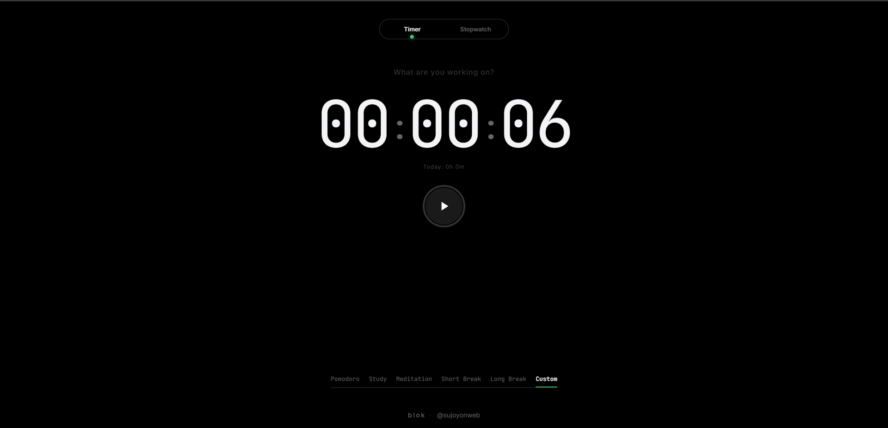

# ⬛ BLOK

**A premium, hardware-inspired focus timer for deep work.**

*No subscriptions. No tracking. Just pure, uninterrupted focus.*

---

## ⏾ Philosophy
Built with the tactile satisfaction of physical hardware in mind. Inspired by industrial design and the Teenage Engineering aesthetic, BLOK features deep matte blacks (`#1C1C1E`), zero-latency segmented controls, and a strictly offline-first architecture. 

## ⚡ Features
- **Tactile Interface** — JetBrains Mono typography, haptic-synced mechanical clicks, and Apple-style spring physics.
- **Momentum Mode** — Push past your goals with an electric violet, sub-pixel optimized glow for overtime tracking.
- **Audiophile Engine** — Gapless BGM loops (Rain & Brown Noise) synchronized with your active timer.
- **Bulletproof Data** — Absolute privacy. Your data never leaves your device. Export pristine `.csv` spreadsheets or securely Smart Merge `.json` backups across devices.
- **Premium Gestures** — Swipe up to reveal settings; swipe down to effortlessly dismiss modals.

## ⚙️ Architecture
BLOK is an enterprise-grade Progressive Web App (PWA) engineered for maximum speed and a microscopic footprint.

- **Stack:** 100% Vanilla HTML5, CSS3, and ES6+ JavaScript.
- **Dependencies:** `0`. No React, no heavy frameworks.
- **Offline Engine:** Custom V8 Service Worker utilizing a Stale-While-Revalidate caching strategy with silent background garbage collection.
- **Native Desktop:** Utilizes `window-controls-overlay` to push the UI seamlessly into the macOS/Windows title bar.

## 📥 Installation
BLOK runs completely offline and installs natively directly from your browser—bypassing App Store bureaucracy entirely.

* **iOS:** Open in Safari ⭢ Tap Share ⭢ `Add to Home Screen`.
* **Android:** Open in Chrome ⭢ Tap `Install App`.
* **Desktop:** Open in Chrome/Edge ⭢ Click the `🖥️ Install` icon in the address bar.

---

**Designed & Engineered by Sujoy**

